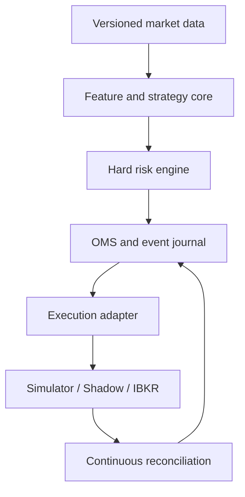
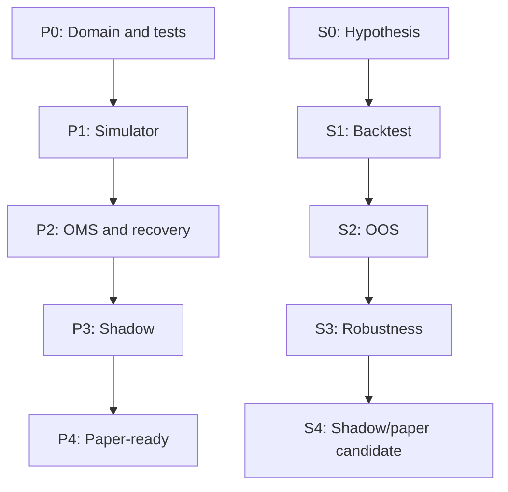

# AI Trading Platform — Phase-by-Phase Execution Plan

**Document status:** Authoritative implementation plan  
**Version:** 1.0  
**Date:** 2026-09-02  
**Owner:** Evan  
**Decision:** Platform development is a **GO**. The previous hourly strategy is a **NO-GO**. Live capital remains a **NO-GO** until every applicable gate passes.

> This is an engineering and research plan, not investment advice or a promise of profitability. A correct platform can host a strategy that fails. Strategy failure must not be hidden by parameter tuning.

---

## 1. Authoritative V1 scope

| Area | V1 decision |
|---|---|
| Market | US-listed common stocks only |
| Timeframe | Daily bars |
| Direction | Long-only |
| Account model | Cash, no leverage |
| Position count | Maximum 3 |
| Holding period | Days to weeks |
| Extended hours | Disabled |
| Earnings | No new entry or holding through scheduled earnings initially |
| Execution modes | Simulator → shadow → IBKR paper → optional tiny live pilot |
| Broker candidate | Interactive Brokers through TWS API / IB Gateway |
| Research data | Dedicated, versioned historical dataset; IBKR is not the canonical research archive |
| Runtime | One Python application plus PostgreSQL and Parquet |
| V1 exclusions | Redis, Kafka, Kubernetes, microservices, n8n in the trading path, LLM order decisions, public broker ports |

### Explicit non-goals

- No high-frequency or intraday trading in V1.
- No shorting, options, leverage, crypto, or futures.
- No self-modifying strategy or autonomous model promotion.
- No LLM access to broker credentials or order-submission functions.
- No production dashboard until the CLI, journal, OMS, recovery, and alerts are proven.
- No claim of historical validity from a frozen present-day symbol list.
- No live deployment merely because the software runs successfully.

---

## 2. Permanent system invariants

These rules apply in simulation, shadow, paper, and live modes.

1. **One common core:** the same strategy, risk, OMS, event, and portfolio code runs in every environment. Only data and execution adapters change.
2. **Fail closed:** stale data, unknown state, broker disconnect, reconciliation mismatch, invalid configuration, or database failure blocks new orders.
3. **Risk precedes execution:** every `OrderIntent` must receive a persisted `RiskDecision` before reaching the OMS.
4. **No unprotected filled position:** any filled entry requiring protection must have a broker-visible protective exit according to policy. The local engine may tighten it, never silently remove it.
5. **Idempotency:** duplicate signals, market events, order acknowledgements, and fills cannot create duplicate economic actions.
6. **Broker truth wins:** PostgreSQL is the local source of truth; actual broker positions, orders, fills, and cash override local assumptions after reconciliation.
7. **Continuous reconciliation:** reconcile on startup, reconnect, every fill, a timer, and end of session.
8. **Immutable audit trail:** all decisions and state transitions are journaled with UTC event time, ingestion time, source, environment, code version, and configuration version.
9. **Environment isolation:** `research`, `simulation`, `shadow`, `paper`, and `live` have separate configuration and credentials. Paper configuration cannot resolve live credentials.
10. **Live is physically/configurationally gated:** `LIVE_TRADING_ENABLED=false` by default. CI cannot enable or submit live orders.
11. **Deterministic replay:** the same dataset, configuration, seed, and code commit must reproduce the same research result.
12. **No lookahead:** a decision can only consume information available at its recorded decision timestamp.
13. **AI is optional:** invalid, missing, stale, or low-confidence AI output is rejected and the deterministic system continues safely.
14. **No LLM-to-broker path:** external content may become validated features; it can never become a direct broker command.
15. **No silent data repair:** missing bars, conflicting corporate actions, timestamp anomalies, and symbol-mapping gaps are quarantined and reported.

---

## 3. Architecture boundary



### V1 technology baseline

- Python 3.12 with strict type checking.
- `uv` or equivalent locked dependency management.
- Pydantic models for boundary validation.
- PostgreSQL with migrations for orders, fills, positions, risk decisions, journal, configuration, and model metadata.
- Parquet for immutable/versioned market and research data.
- `pytest`, property-based testing, and deterministic fixtures.
- Structured JSON logs, metrics, and an external heartbeat service.
- Docker Compose for local development only; a dedicated Linux VM for later shadow/paper operation.
- Official IBKR API behind a `BrokerAdapter`; no IBKR types may leak into the domain layer.

### Suggested repository layout

```text
trading-platform/
├── pyproject.toml
├── README.md
├── docs/
│   ├── architecture/
│   ├── decisions/
│   ├── runbooks/
│   └── research/
├── config/
│   ├── research/
│   ├── simulation/
│   ├── shadow/
│   └── paper/
├── src/trading_platform/
│   ├── domain/
│   ├── data/
│   ├── features/
│   ├── strategies/
│   ├── risk/
│   ├── oms/
│   ├── execution/
│   ├── reconciliation/
│   ├── persistence/
│   ├── observability/
│   └── cli/
├── migrations/
├── tests/
│   ├── unit/
│   ├── integration/
│   ├── property/
│   ├── replay/
│   └── failure/
├── research/
│   ├── experiments/
│   └── reports/
└── infra/
```

---

## 4. Two-track promotion model

Platform maturity and strategy evidence are independent.



- A strategy may fail at `S1`, `S2`, or `S3` while the platform continues toward `P4` using a test-harness strategy.
- A platform defect blocks every strategy from promotion.
- Passing platform gates does not imply profitability.
- Passing a historical strategy gate does not imply future profitability.

---

## 5. Phase summary and realistic sequencing

| Phase | Name | Indicative solo-engineer effort | Promotion result |
|---:|---|---:|---|
| 0 | Charter, constraints, and decision log | 2–4 days | Scope frozen |
| 1 | Repository, domain model, and safety shell | 1–2 weeks | P0 |
| 2 | Historical data and provenance | 2–3 weeks | Data Gate |
| 3 | Event-driven simulator | 2–3 weeks | P1 |
| 4 | Deterministic baseline and research harness | 2 weeks | S1 candidate |
| 5 | OOS, walk-forward, and robustness | 2–4 weeks per hypothesis cycle | S2/S3 or strategy rejection |
| 6 | Production OMS, hard risk, and reconciliation | 3–4 weeks | P2 |
| 7 | Failure injection, security, and recovery | 2–3 weeks | Recovery Gate |
| 8 | Live-data shadow mode and operations | 3–6 weeks elapsed | P3/S4 |
| 9 | IBKR paper integration | 2–3 weeks setup + test window | P4 |
| 10 | Extended paper validation | At least 60 trading days plus sample/regime criteria | Paper Evidence Gate |
| 11 | ML ranking; optional LLM news forward test | 3–6 weeks build + forward evidence | AI promotion or rejection |
| 12 | Tiny live pilot and controlled scaling | Separate authorization; months of evidence | Optional live candidate |

**Planning expectation:** core platform through initial shadow readiness is roughly 14–22 focused engineering weeks. Paper and forward-validation gates add calendar time. A part-time solo build can reasonably take 6–12+ months. Do not compress evidence windows to meet a calendar target.

---

## 6. Detailed phase execution

## Phase 0 — Charter, constraints, and decision log

**Objective:** remove unresolved assumptions before implementation.

### Work

- Write `docs/product-charter.md` with the exact V1 scope and non-goals.
- Create architecture decision records for daily bars, cash/no leverage, one Python process, PostgreSQL + Parquet, and adapter-based execution.
- Define the legal/account checkpoint separately from the engineering path:
  - actual legal and tax residence;
  - permitted broker account and funding route;
  - market-data licensing and display restrictions;
  - reporting and tax-record obligations.
- Verify current IBKR onboarding, paper access, market-data subscriptions, order-type behavior, authentication, and regional availability directly before broker work.
- Select a research-data path only after a data-vendor spike confirms coverage, corporate actions, delistings, point-in-time availability, licensing, and reproducibility.
- Create an initial risk-policy document with values marked `PROVISIONAL`; do not pretend unvalidated thresholds are safe.
- Create the experiment registry schema before testing strategies.

### Deliverables

- Product charter and risk-policy draft.
- Architecture Decision Records (ADRs).
- Verified-broker-facts checklist with verification dates and primary-source links.
- Data-vendor decision matrix.
- Cost ceiling for research data, infrastructure, and subscriptions.

### Exit gate G0

- [ ] No unresolved contradiction in V1 account, timeframe, or execution mode.
- [ ] Live and paper credentials are explicitly out of scope for early phases.
- [ ] Engineering can proceed without misrepresenting residency or KYC facts.
- [ ] Data requirements are documented; vendor selection may remain a bounded Phase 2 spike.

**Stop condition:** if the purpose is near-term income from an approximately $10k account, pause and reassess the business case. Continue only if the primary purpose is engineering, research, or a reusable platform.

---

## Phase 1 — Repository, domain model, and safety shell

**Objective:** create a typed, testable core before strategy code.

### Work

- Scaffold the repository, dependency lock, linting, formatting, type checking, tests, migrations, and pre-commit hooks.
- Define immutable domain types:
  - `Instrument`, `TradingSession`, `Bar`, `CorporateAction`;
  - `Signal`, `OrderIntent`, `RiskDecision`;
  - `Order`, `OrderLeg`, `Execution`, `Position`, `PortfolioSnapshot`;
  - `BrokerSnapshot`, `ReconciliationResult`, `JournalEvent`.
- Define enums and state machines for order and position lifecycle.
- Implement configuration parsing with environment allowlists and startup validation.
- Implement an append-only event journal interface and deterministic clock/ID abstractions.
- Add structured logging with secret redaction.
- Encode permanent invariants as tests before adapters exist.

### Required tests

- Invalid/NaN/negative price and quantity rejection.
- Illegal order transition rejection.
- Environment/credential mismatch rejection.
- Duplicate event idempotency.
- Deterministic ID, time, and replay behavior.
- Secret-redaction tests.

### Exit gate G1 / P0

- [ ] Domain layer has zero broker/vendor imports.
- [ ] All state transitions are explicit and tested.
- [ ] `paper` cannot load `live` credentials in an automated test.
- [ ] CI passes format, lint, types, unit tests, dependency audit, and secret scan.
- [ ] Architecture and invariants are documented before feature implementation.

---

## Phase 2 — Historical data, calendar, and provenance

**Objective:** create reproducible daily data that cannot silently introduce lookahead or adjustment errors.

### Work

- Implement `MarketDataProvider` and `CorporateActionProvider` interfaces.
- Ingest raw daily OHLCV, splits, dividends, ticker changes, delistings, and trading calendars.
- Store raw/unadjusted data plus point-in-time adjustment factors; derive adjusted research views reproducibly.
- Preserve source timestamps, retrieval timestamps, vendor identifiers, licenses, checksums, schema version, and dataset version.
- Implement exchange sessions, holidays, half-days, and UTC/exchange-local conversion.
- Build validation for gaps, duplicates, non-monotonic timestamps, impossible OHLC, suspicious jumps, missing actions, and symbol-map conflicts.
- Maintain two universe concepts:
  - **engineering universe:** a small fixed list used only to test plumbing;
  - **research universe:** point-in-time membership including removed/delisted names when strategy claims require it.
- Create a frozen dataset manifest used by every experiment.

### Deliverables

- Versioned Parquet datasets and manifest.
- Data-quality report by symbol/date.
- Corporate-action adjustment specification.
- Point-in-time universe policy.
- Reproducible ingestion command and fixture dataset.

### Exit gate G2 / Data Gate

- [ ] Re-running ingestion against the same source snapshot yields the same hashes.
- [ ] Known split/dividend fixtures adjust correctly.
- [ ] No experiment can query data after its decision timestamp.
- [ ] Missing or conflicted data blocks affected decisions rather than being silently filled.
- [ ] A frozen 2026 universe is labelled engineering-only and carries no promotion evidence.

---

## Phase 3 — Event-driven simulator

**Objective:** prove that the common core can model orders, fills, costs, gaps, and recovery realistically.

### Work

- Implement an event loop using the same strategy → risk → OMS → execution interfaces intended for paper/live.
- Model market, limit, stop, and bracket/OCA semantics at the fidelity supported by available data.
- Model commission, spread, slippage, next-session gaps, rejection, partial fills, unfilled limits, cancellation, and order expiry.
- Make fill assumptions explicit and configurable; never assume execution at a signal bar's close.
- Add cash settlement accounting and buying-power checks appropriate to a cash account.
- Implement whole-share quantization and record target risk, actual risk, and sizing error.
- Support checkpoint, crash, restart, journal replay, and state reconstruction.
- Produce a trade ledger, order ledger, portfolio series, cost attribution, and reconciliation report.

### Required failure scenarios

- Duplicate bar and signal.
- Partial and duplicate fill.
- Gap through protective stop.
- Restart with an open order.
- Late fill after cancellation request.
- Market closed or missing next bar.
- Insufficient settled cash.
- Price/ATR unavailable or stale.

### Exit gate G3 / P1

- [ ] Zero lookahead in event ordering.
- [ ] Zero duplicate economic orders under duplicate inputs.
- [ ] Restart produces the same final state as uninterrupted execution.
- [ ] Costs and fill assumptions are visible in every report.
- [ ] A gap-through-stop loss is reported at simulated fill, not the stop price.
- [ ] The simulator and future broker adapters satisfy the same contract tests.

---

## Phase 4 — Deterministic baseline and research harness

**Objective:** create a transparent test-harness strategy and a disciplined experiment system.

### Work

- Specify one simple daily long-only hypothesis. Parameters are hypotheses, not targets to optimize until profitable.
- Define signal timing, entry order, protective order, time-in-force, exit, maximum holding period, earnings blackout, and deterministic collision ranking.
- Add position, sector, gross-exposure, settled-cash, and provisional portfolio-risk limits.
- Reject orders with unacceptable sizing error, stale inputs, missing corporate actions, or unavailable protection.
- Persist every experiment, including failures:
  - hypothesis and parameters;
  - dataset hash and universe version;
  - code commit and dependency lock hash;
  - cost/slippage assumptions;
  - seed and result metrics.
- Produce an engineering baseline report. A fixed-symbol run is allowed only as a system test, not as strategy evidence.

### Metrics

- Expectancy, profit factor, annualized return, Sharpe, Sortino, drawdown, turnover, exposure, trade count, win/loss distribution, MAE/MFE, costs, concentration, and FX-separated performance when applicable.

### Exit gate G4 / S1 candidate

- [ ] Strategy specification has no ambiguous order or collision behavior.
- [ ] Backtest and replay are deterministic.
- [ ] Every trial is registered, not only winners.
- [ ] Results include costs and gap behavior.
- [ ] Engineering acceptance is reported separately from strategy performance.

**Strategy-failure action:** mark the hypothesis `REJECTED`, preserve the evidence, and test a new pre-registered hypothesis. Do not tune on the final test set.

---

## Phase 5 — Out-of-sample, walk-forward, and robustness

**Objective:** determine whether a strategy deserves shadow testing without contaminating the final test.

### Work

- Freeze chronological train, validation, and final-test periods before tuning.
- Perform walk-forward evaluation with documented retraining/recalibration rules.
- Test sensitivity across a neighborhood of parameters; reject isolated “magic values.”
- Increase commission and slippage assumptions and rerun.
- Run trade-sequence bootstrap/Monte Carlo to estimate a drawdown distribution.
- Measure sector/symbol concentration and whether one trade or period dominates.
- Record number of hypotheses and parameter trials; apply a multiple-testing adjustment appropriate to the experiment count.
- Test on multiple market and volatility conditions.
- Keep the final test locked until the research decision is complete.

### Exit gate G5 / S2–S3

- [ ] Positive out-of-sample expectancy after costs, if profitability is the hypothesis.
- [ ] No single trade, symbol, or short interval explains the result.
- [ ] Performance remains acceptable under worse costs and nearby parameters.
- [ ] Drawdown distribution fits the provisional risk budget.
- [ ] Results are stable enough to justify forward testing.
- [ ] A failed result is rejected without reopening the final test for repeated tuning.

**No-go:** failure here blocks strategy promotion, not platform work.

---

## Phase 6 — Production OMS, hard risk, and reconciliation

**Objective:** build broker-grade state management and controls independently of profitability.

### Work

- Implement the OMS state machine, idempotency keys, parent/child legs, OCA groups, cancellation, replacement, and timeout handling.
- Implement the hard risk engine with versioned policies and persisted decisions.
- Add independent controls:
  - disable strategy;
  - disable symbol;
  - block new positions;
  - disable all submissions;
  - cancel open orders;
  - separate, explicit position-liquidation command.
- Implement `BrokerAdapter` contract tests using a deterministic fake broker.
- Implement reconciliation of cash, buying power, positions, orders, and fills.
- Trigger reconciliation on startup, reconnect, fill, timer, and end of session.
- Add protected-position checks and escalation for missing/mismatched exit orders.
- Add session scheduling and fail-closed behavior around market/calendar uncertainty.

### Required property/invariant tests

- A proposed order never breaches a hard limit under generated portfolios.
- A duplicate signal/fill never doubles exposure.
- An unresolved reconciliation difference disables submissions.
- A filled protected position cannot transition to healthy state without required protection.
- Cancel-all does not liquidate positions.
- Live mode cannot activate through one configuration change alone.

### Exit gate G6 / P2

- [ ] Zero duplicate orders in all deterministic and randomized tests.
- [ ] Zero hard-risk violations in generated scenarios.
- [ ] 100% state reconstruction after restart fixtures.
- [ ] 100% reconciliation after reconnect fixtures.
- [ ] All mismatches fail closed and produce actionable events.
- [ ] OMS journal explains every order and transition.

---

## Phase 7 — Failure injection, security, backup, and recovery

**Objective:** prove capital safety when components fail.

### Work

- Inject internet loss, database loss, process kill, clock skew, stale quote, duplicate event, broker rejection, partial/late fill, disk pressure, and restart during open orders.
- Threat-model external data, model output, operator access, CI, dependencies, secrets, database, and broker ports.
- Keep broker API private/local; firewall database and management ports.
- Use runtime secret injection and separate environment credentials.
- Create encrypted backups and execute a clean-room restore drill.
- Write runbooks for disconnect, stale data, position mismatch, missing protection, DB failure, gateway authentication, and emergency stop.
- Add an external dead-man heartbeat outside the trading VM's failure domain.

### Exit gate G7 / Recovery Gate

- [ ] Capital-safety invariants survive every mandatory failure scenario.
- [ ] VM/process death triggers an external alert.
- [ ] A backup has been restored and validated, not merely created.
- [ ] CI has no live trade authority.
- [ ] Secret scan and security review pass.
- [ ] Recovery runbooks have been executed at least once.

---

## Phase 8 — Live-data shadow mode and operations

**Objective:** run the production engine on current data without sending orders.

### Work

- Connect live/delayed data as appropriate, validate bar completion, and archive incoming data.
- Generate `WOULD_SUBMIT` intents with full risk decisions, hypothetical orders, and expected protection; never call broker submission.
- Compare live features/signals with offline replay from the archived data.
- Deploy on a dedicated Linux VM with no public broker port.
- Add metrics for heartbeat, data freshness, decision latency, signals, risk rejections, reconciliation state, database health, and journal lag.
- Send critical alerts through at least two independent channels where practical.
- Run daily operational review and weekly discrepancy report.

### Exit gate G8 / P3 / S4

- [ ] Zero unexplained signal differences between live archive replay and shadow decisions.
- [ ] Zero stale-data decisions.
- [ ] Zero duplicate hypothetical orders.
- [ ] Every expected trading session has complete monitoring evidence.
- [ ] External dead-man alert and recovery procedure are proven.
- [ ] Strategy meets a predeclared minimum forward sample before paper promotion.

---

## Phase 9 — IBKR paper integration

**Objective:** verify the broker boundary and operational behavior without live capital.

### Prerequisites

- Current account/paper availability and market-data behavior verified directly.
- Required subscriptions and API permissions confirmed.
- Manual authentication/restart procedure documented.
- Phases 1–8 applicable gates passed.

### Work

- Implement the IBKR adapter without leaking IBKR-specific objects into core logic.
- Validate connection lifecycle, IDs, order acknowledgements, parent/child transmission, OCA behavior, rejection mapping, cancel/replace, fills, and account snapshots.
- Reconcile at startup, after reconnect, after fills, on timer, and end of session.
- Record known paper-simulator limitations; do not treat paper fills as live-quality evidence.
- Test the manual authentication and fail-closed disconnect path.
- Maintain `LIVE_TRADING_ENABLED=false`; use separate paper credentials/configuration.

### Exit gate G9 / P4

- [ ] Zero unexplained paper positions.
- [ ] Zero unresolved fills or duplicate submissions.
- [ ] 100% order-state recovery after controlled restart tests.
- [ ] Protective-order behavior is observed and documented.
- [ ] Broker disconnect blocks new orders and alerts externally.
- [ ] Local and broker state reconcile continuously.

---

## Phase 10 — Extended paper validation

**Objective:** accumulate enough operational and strategy evidence across time, trades, and conditions.

### Minimum criteria

- At least 60 trading days **and** a predeclared meaningful number of executed signals.
- More than one volatility/market condition.
- Zero duplicate orders, unexplained positions, unresolved fills, hard-risk violations, or stale-data trades.
- All restarts and reconnects reconcile successfully.
- Realized paper behavior is compared with shadow and simulator assumptions.
- Drawdowns, turnover, costs, rejects, partial fills, and sizing deviations remain within policy.

### Exit gate G10 / Paper Evidence Gate

- [ ] Engineering acceptance is perfect on all hard safety metrics.
- [ ] Strategy evidence remains acceptable under the predeclared rules.
- [ ] No critical incident remains open.
- [ ] Operator runbooks and weekend/manual-authentication routine are sustainable.

**No-go:** 60 days alone is insufficient if the trade sample or regime coverage is weak.

---

## Phase 11 — ML ranking and optional LLM news forward test

**Objective:** let AI earn promotion through controlled comparison with the deterministic baseline.

### Stage A — ML candidate ranking

- Use only valid deterministic candidates; ML changes ranking, not hard eligibility or risk.
- Define chronological labels and prevent feature leakage.
- Register model ID, training period, features, hyperparameters, dataset hash, code commit, metrics, and creation date.
- Compare `BASELINE` versus `BASELINE + RANKER` on identical data and forward conditions.
- Reject malformed, stale, missing, or out-of-range inference.
- Keep deterministic fallback behavior.

### Stage B — optional LLM news features

- Treat LLM-derived historical news sentiment as unsuitable for promotion evidence unless the model and news corpus are demonstrably point-in-time.
- Default policy: forward-test LLM news features only.
- Convert external content to a strict schema, validate it, and store provenance.
- Test prompt injection, invalid JSON, unknown symbols, contradictory output, timeout, 500 errors, NaN, and impossible confidence.
- The LLM has no broker tool, credentials, network route, or order-submission capability.

### Exit gate G11 / AI Gate

AI qualifies only if, after costs and risk, it provides at least one durable benefit:

- higher risk-adjusted return;
- similar return with lower drawdown;
- similar return with fewer trades/lower costs;
- improved stability or candidate precision without new safety failures.

Otherwise, remove or keep it research-only. The project name is not evidence.

---

## Phase 12 — Tiny live pilot and evidence-based scaling

**Objective:** consider a tightly capped live experiment only after separate authorization.

### Mandatory prerequisites

- Legal/residency, tax, account, funding, and market-data obligations verified.
- G0–G10 passed; G11 only if AI will be active.
- Independent review of code, security, risk policy, and operational runbooks.
- Explicit maximum capital, position, daily loss, drawdown, and gross-exposure limits.
- Live credentials inaccessible to research, CI, and paper environments.
- Operator authorization plus reconciliation OK at every startup.
- Written rollback and incident plan.

### Pilot rules

- Use capital whose complete loss is tolerable.
- Start below theoretical capacity and scale only after a new review window.
- Do not change multiple variables at once.
- AI, if used, remains removable and subordinate to deterministic risk.
- Ordinary shutdown cancels/blocks as configured; liquidation is a separate explicit action.

### Exit gate G12

- There is no automatic “pass into scaling.” Each increase requires a new written decision based on live operational and risk evidence.

---

## 7. Engineering acceptance criteria

These are hard requirements, not aspirational metrics.

| Metric | Required result before live consideration |
|---|---:|
| Duplicate submitted orders | 0 |
| Unexplained positions | 0 |
| Unresolved fills | 0 |
| Hard-risk violations | 0 |
| Stale-data trades | 0 |
| LLM direct broker access | 0 |
| Restart state recovery | 100% in required scenarios |
| Reconnect reconciliation | 100% in required scenarios |
| Required protective-order coverage | 100% |
| External heartbeat coverage | 100% during scheduled operation |
| Backup restore drill | Passed |

---

## 8. Risk-policy items to decide empirically

Do not hard-code final numbers in Phase 0. Each value needs evidence and a test showing it can trigger.

- Maximum position notional and actual risk.
- Maximum gross and sector exposure.
- Maximum correlated/beta-weighted exposure.
- Daily and rolling loss limits.
- Peak-to-trough drawdown halt.
- Maximum sizing error after whole-share quantization.
- Minimum liquidity and maximum spread.
- Earnings blackout window.
- Maximum data age and decision latency.
- Maximum reconciliation mismatch duration.
- Maximum number of orders/cancels per session.
- FX exposure and conversion-cost treatment.

Every limit must have:

1. rationale;
2. unit and calculation;
3. scope and reset behavior;
4. reachable boundary test;
5. reject/halt action;
6. alert severity;
7. policy version recorded with each decision.

---

## 9. Coding-agent execution protocol

Every implementation ticket must explicitly instruct the coding agent to use the **Jeff Allan fullstack skill set**, centered on **Fullstack Guardian**, and the phase-relevant specialist skills. The Fullstack Guardian workflow requires requirements and acceptance criteria, three-perspective design, a technical design, a security checkpoint, incremental tested implementation, and QA/deployment handoff. See the [Jeff Allan Skills Guide](https://jeffallan.github.io/claude-skills/skills-guide/) and [Fullstack Guardian](https://jeffallan.github.io/claude-skills/skills/security/fullstack-guardian/).

### Skill combination by work type

| Work | Required Jeff Allan skill set |
|---|---|
| New platform feature | Feature Forge + Architecture Designer + Fullstack Guardian + Python Pro + Test Master |
| PostgreSQL/persistence | Fullstack Guardian + PostgreSQL Pro + SQL Pro + Database Optimizer + Test Master |
| Broker/API adapter | Fullstack Guardian + API Designer + Python Pro + Secure Code Guardian + Test Master |
| Security-sensitive change | Secure Code Guardian + Fullstack Guardian + Security Reviewer + Test Master |
| Failure/recovery work | Debugging Wizard + Chaos Engineer + SRE Engineer + Monitoring Expert + Test Master |
| ML/data pipeline | Pandas Pro + ML Pipeline Expert + Python Pro + Test Master + Monitoring Expert |
| Deployment | DevOps Engineer + SRE Engineer + Monitoring Expert + Security Reviewer |
| Final review | Code Reviewer + Security Reviewer + Architecture Designer |

For this V1, “fullstack” means the complete operator-to-broker path: CLI/operator controls, application/domain logic, persistence, security, and operations. Do not create a web frontend merely to satisfy the term.

### Mandatory ticket template

```markdown
# Ticket: <small, testable outcome>

## Agent instruction
Use the Jeff Allan fullstack skill set: Fullstack Guardian plus <phase-specific skills>.

## Context
<phase, relevant ADRs, invariants, existing interfaces>

## Scope
- <included work>

## Out of scope
- <explicit exclusions>

## Acceptance criteria
- [ ] <observable behavior>
- [ ] <failure behavior>
- [ ] <tests and evidence>

## Security and risk checkpoint
- <credentials, validation, authorization, fail-closed behavior>

## Verification commands
- `<exact command>`

## Required handoff
- Files changed
- Tests run and results
- Risks/assumptions
- Follow-up work
```

### Agent rules

- One bounded ticket at a time; no opportunistic architecture rewrites.
- Read current ADRs and invariants before editing.
- Write or update the technical design for non-trivial changes.
- Add tests with each behavior; never defer safety tests.
- Preserve failed research results and experiment metadata.
- Never insert real credentials, lower a safety limit to pass a test, or enable live trading.
- Stop and report if requirements conflict with a permanent invariant.

---

## 10. Immediate first backlog

Execute these tickets in order:

1. Create the product charter, non-goals, glossary, and risk-policy skeleton.
2. Add ADRs for daily bars, cash/no leverage, common core, PostgreSQL + Parquet, and execution adapters.
3. Scaffold Python project quality gates and CI without any trading logic.
4. Implement domain value objects and validation.
5. Implement order/position state machines and invariant tests.
6. Implement environment isolation and configuration contract tests.
7. Implement journal, clock, and deterministic ID interfaces.
8. Perform the research-data vendor spike and write the decision matrix.
9. Implement raw daily-bar and corporate-action ingestion.
10. Build dataset validation and manifests.
11. Implement the simulator event loop and fake broker.
12. Add fills, costs, gaps, cash settlement, and restart/replay tests.

Do not start broker integration, AI, a dashboard, or cloud deployment during this backlog.

---

## 11. Phase review record

At the end of every phase, create `docs/reviews/phase-<n>-review.md`:

```markdown
# Phase <n> Review

Decision: PASS | CONDITIONAL PASS | FAIL

## Evidence
- Commits:
- Dataset/config versions:
- Test reports:
- Operational observations:

## Acceptance criteria
- [ ] ...

## Open defects
- Severity / owner / deadline

## Assumptions invalidated
- ...

## Promotion decision
- What may start next
- What remains prohibited
```

Only `PASS` promotes the system. `CONDITIONAL PASS` may permit bounded remediation work but cannot authorize paper/live progression.

---

## 12. Final execution rule

> Build a risk-controlled, replayable trading platform first. Treat every strategy and every AI component as a replaceable experiment. Promote only with reproducible evidence, and fail closed whenever state, data, protection, or authorization is uncertain.

